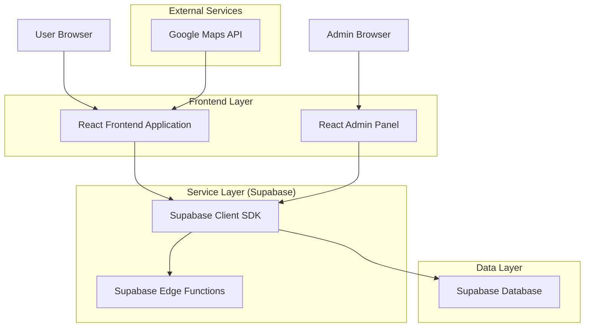
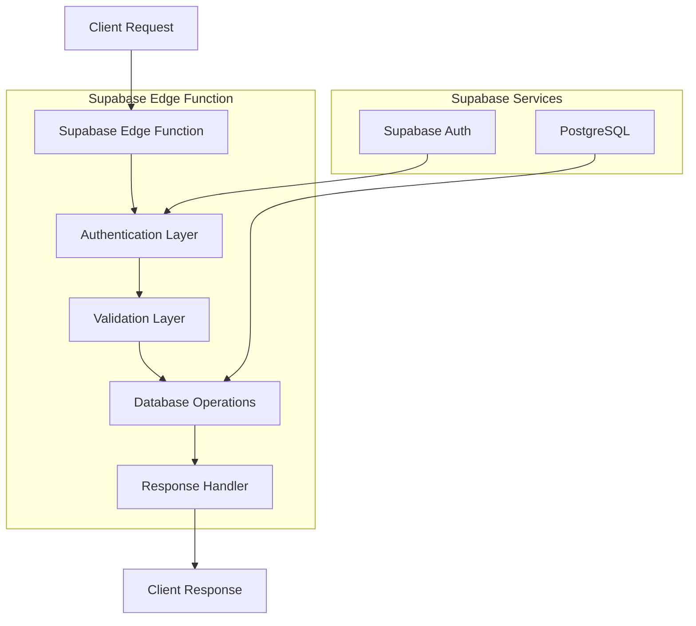
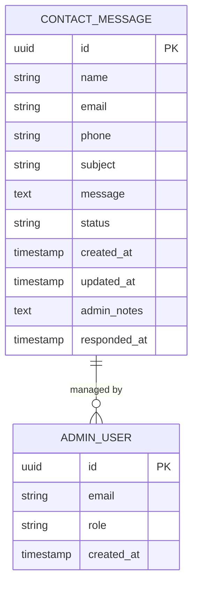

## 1. Architecture Design



## 2. Technology Description

* **Frontend**: React\@18 + TypeScript + TailwindCSS\@3 + Vite

* **Initialization Tool**: vite-init (default for React projects)

* **Backend**: Supabase (Backend-as-a-Service)

* **Database**: PostgreSQL (via Supabase)

* **Authentication**: Supabase Auth

* **Styling**: TailwindCSS with custom CSS classes matching About page theme

* **Icons**: Lucide React

* **Maps**: Google Maps Embed API

## 3. Route Definitions

| Route                    | Purpose                                                                  |
| ------------------------ | ------------------------------------------------------------------------ |
| /contact                 | Enhanced Contact Us page with theme matching and Google Maps integration |
| /admin/contact-messages  | Admin dashboard for viewing and managing contact form submissions        |
| /api/contact/submit      | API endpoint for processing contact form submissions                     |
| /api/contact/messages    | API endpoint for retrieving contact messages (admin only)                |
| /api/contact/message/:id | API endpoint for updating individual message status                      |

## 4. API Definitions

### 4.1 Contact Form Submission API

```
POST /api/contact/submit
```

Request:

| Param Name | Param Type | isRequired | Description                                  |
| ---------- | ---------- | ---------- | -------------------------------------------- |
| name       | string     | true       | Full name of the person contacting           |
| email      | string     | true       | Valid email address for response             |
| phone      | string     | false      | Phone number (optional)                      |
| subject    | string     | true       | Subject/topic of the inquiry                 |
| message    | string     | true       | Detailed message content (min 10 characters) |

Response:

| Param Name | Param Type | Description                                 |
| ---------- | ---------- | ------------------------------------------- |
| success    | boolean    | Indicates if submission was successful      |
| messageId  | string     | Unique identifier for the submitted message |
| timestamp  | string     | ISO timestamp of submission                 |

Example Request:

```json
{
  "name": "John Doe",
  "email": "john@example.com",
  "phone": "+91 98765 43210",
  "subject": "Product Inquiry",
  "message": "I would like to know more about your canvas prints and pricing options."
}
```

### 4.2 Contact Messages Retrieval API

```
GET /api/contact/messages
```

Query Parameters:

| Param Name | Param Type | isRequired | Description                                                 |
| ---------- | ---------- | ---------- | ----------------------------------------------------------- |
| status     | string     | false      | Filter by message status (all, unread, responded, archived) |
| search     | string     | false      | Search term for name, email, or subject                     |
| limit      | number     | false      | Number of results to return (default: 50, max: 100)         |
| offset     | number     | false      | Number of results to skip for pagination                    |

Response:

| Param Name | Param Type | Description                               |
| ---------- | ---------- | ----------------------------------------- |
| messages   | array      | Array of contact message objects          |
| total      | number     | Total count of messages matching criteria |
| hasMore    | boolean    | Indicates if more results are available   |

### 4.3 Message Status Update API

```
PATCH /api/contact/message/:id
```

Request:

| Param Name | Param Type | isRequired | Description                            |
| ---------- | ---------- | ---------- | -------------------------------------- |
| status     | string     | true       | New status (read, responded, archived) |
| notes      | string     | false      | Internal admin notes about the message |

## 5. Server Architecture Diagram



## 6. Data Model

### 6.1 Data Model Definition



### 6.2 Data Definition Language

**Contact Messages Table**

```sql
-- Create contact_messages table
CREATE TABLE public.contact_messages (
    id UUID PRIMARY KEY DEFAULT gen_random_uuid(),
    name VARCHAR(100) NOT NULL,
    email VARCHAR(255) NOT NULL,
    phone VARCHAR(20),
    subject VARCHAR(200) NOT NULL,
    message TEXT NOT NULL,
    status VARCHAR(20) DEFAULT 'unread' CHECK (status IN ('unread', 'read', 'responded', 'archived')),
    admin_notes TEXT,
    created_at TIMESTAMP WITH TIME ZONE DEFAULT NOW(),
    updated_at TIMESTAMP WITH TIME ZONE DEFAULT NOW(),
    responded_at TIMESTAMP WITH TIME ZONE
);

-- Create indexes for performance
CREATE INDEX idx_contact_messages_created_at ON public.contact_messages(created_at DESC);
CREATE INDEX idx_contact_messages_status ON public.contact_messages(status);
CREATE INDEX idx_contact_messages_email ON public.contact_messages(email);

-- Set up Row Level Security (RLS)
ALTER TABLE public.contact_messages ENABLE ROW LEVEL SECURITY;

-- Grant access to anon role for form submissions
GRANT INSERT ON public.contact_messages TO anon;
GRANT SELECT ON public.contact_messages TO authenticated;
GRANT UPDATE ON public.contact_messages TO authenticated;

-- Create policies for different operations
CREATE POLICY "Allow anonymous submissions" ON public.contact_messages
    FOR INSERT TO anon WITH CHECK (true);

CREATE POLICY "Allow authenticated users to read messages" ON public.contact_messages
    FOR SELECT TO authenticated USING (true);

CREATE POLICY "Allow authenticated users to update message status" ON public.contact_messages
    FOR UPDATE TO authenticated USING (true) WITH CHECK (true);

-- Create updated_at trigger
CREATE OR REPLACE FUNCTION update_updated_at_column()
RETURNS TRIGGER AS $$
BEGIN
    NEW.updated_at = NOW();
    RETURN NEW;
END;
$$ language 'plpgsql';

CREATE TRIGGER update_contact_messages_updated_at 
    BEFORE UPDATE ON public.contact_messages 
    FOR EACH ROW 
    EXECUTE FUNCTION update_updated_at_column();
```

**Sample Data for Testing**

```sql
-- Insert sample contact messages for testing
INSERT INTO public.contact_messages (name, email, phone, subject, message, status) VALUES
('John Doe', 'john@example.com', '+91 98765 43210', 'Product Inquiry', 'I am interested in your canvas prints. Can you provide pricing information?', 'unread'),
('Jane Smith', 'jane@example.com', NULL, 'Order Status', 'I placed an order last week and would like to know the delivery status.', 'read'),
('Robert Johnson', 'robert@example.com', '+91 87654 32109', 'Custom Order', 'Do you offer custom framing services for large prints?', 'responded'),
('Maria Garcia', 'maria@example.com', NULL, 'Website Feedback', 'Your website looks great! Just wanted to say keep up the good work.', 'archived');
```

### 6.3 Supabase Edge Functions

**Contact Form Submission Function**

```typescript
// supabase/functions/contact-submit/index.ts
import { serve } from 'https://deno.land/std@0.168.0/http/server.ts'
import { createClient } from 'https://esm.sh/@supabase/supabase-js@2'

const corsHeaders = {
  'Access-Control-Allow-Origin': '*',
  'Access-Control-Allow-Headers': 'authorization, x-client-info, apikey, content-type',
}

serve(async (req) => {
  if (req.method === 'OPTIONS') {
    return new Response('ok', { headers: corsHeaders })
  }

  try {
    const { name, email, phone, subject, message } = await req.json()
    
    // Validation
    if (!name || !email || !subject || !message) {
      throw new Error('Missing required fields')
    }
    
    // Email validation
    const emailRegex = /^[^\s@]+@[^\s@]+\.[^\s@]+$/
    if (!emailRegex.test(email)) {
      throw new Error('Invalid email format')
    }
    
    // Message length validation
    if (message.length < 10) {
      throw new Error('Message must be at least 10 characters long')
    }

    const supabase = createClient(
      Deno.env.get('SUPABASE_URL') ?? '',
      Deno.env.get('SUPABASE_ANON_KEY') ?? '',
    )

    const { data, error } = await supabase
      .from('contact_messages')
      .insert([{ name, email, phone, subject, message }])
      .select()
      .single()

    if (error) throw error

    return new Response(
      JSON.stringify({ success: true, messageId: data.id, timestamp: data.created_at }),
      { headers: { ...corsHeaders, 'Content-Type': 'application/json' } }
    )
  } catch (error) {
    return new Response(
      JSON.stringify({ success: false, error: error.message }),
      { headers: { ...corsHeaders, 'Content-Type': 'application/json' }, status: 400 }
    )
  }
})
```

**Contact Messages Retrieval Function**

```typescript
// supabase/functions/contact-messages/index.ts
import { serve } from 'https://deno.land/std@0.168.0/http/server.ts'
import { createClient } from 'https://esm.sh/@supabase/supabase-js@2'

const corsHeaders = {
  'Access-Control-Allow-Origin': '*',
  'Access-Control-Allow-Headers': 'authorization, x-client-info, apikey, content-type',
}

serve(async (req) => {
  if (req.method === 'OPTIONS') {
    return new Response('ok', { headers: corsHeaders })
  }

  try {
    const supabase = createClient(
      Deno.env.get('SUPABASE_URL') ?? '',
      Deno.env.get('SUPABASE_SERVICE_ROLE_KEY') ?? '',
    )

    const url = new URL(req.url)
    const status = url.searchParams.get('status') || 'all'
    const search = url.searchParams.get('search') || ''
    const limit = Math.min(parseInt(url.searchParams.get('limit') || '50'), 100)
    const offset = parseInt(url.searchParams.get('offset') || '0')

    let query = supabase
      .from('contact_messages')
      .select('*', { count: 'exact' })
      .order('created_at', { ascending: false })

    if (status !== 'all') {
      query = query.eq('status', status)
    }

    if (search) {
      query = query.or(`name.ilike.%${search}%,email.ilike.%${search}%,subject.ilike.%${search}%`)
    }

    query = query.range(offset, offset + limit - 1)

    const { data, count, error } = await query

    if (error) throw error

    return new Response(
      JSON.stringify({
        messages: data,
        total: count,
        hasMore: (offset + data.length) < count
      }),
      { headers: { ...corsHeaders, 'Content-Type': 'application/json' } }
    )
  } catch (error) {
    return new Response(
      JSON.stringify({ success: false, error: error.message }),
      { headers: { ...corsHeaders, 'Content-Type': 'application/json' }, status: 400 }
    )
  }
})
```

