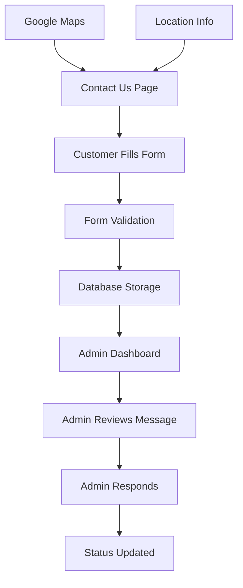

## 1. Product Overview

Comprehensive overhaul of the Contact Us page to match the About page theme with enhanced user experience, Google Maps integration, and complete backend infrastructure for contact message management with admin panel integration.

This upgrade transforms the basic contact form into a professional, theme-consistent communication hub that strengthens customer engagement and provides administrative oversight of customer inquiries.

## 2. Core Features

### 2.1 User Roles

| Role            | Registration Method        | Core Permissions                                      |
| --------------- | -------------------------- | ----------------------------------------------------- |
| Website Visitor | No registration required   | Can submit contact messages, view location details    |
| Admin User      | Email-based authentication | Can view, manage, and respond to all contact messages |

### 2.2 Feature Module

Our contact management system consists of the following main pages:

1. **Contact Us Page**: Enhanced contact form with theme matching, Google Maps integration, and improved user experience
2. **Admin Contact Messages**: Dedicated admin interface for viewing and managing all customer contact submissions

### 2.3 Page Details

| Page Name              | Module Name             | Feature description                                                                                                          |
| ---------------------- | ----------------------- | ---------------------------------------------------------------------------------------------------------------------------- |
| Contact Us             | Hero Section            | Full-width hero banner with decorative imagery matching About page styling, gradient overlay, and compelling headline        |
| Contact Us             | Contact Form            | Multi-field contact form with name, email, phone, subject, and message fields with real-time validation and enhanced styling |
| Contact Us             | Location Information    | Display physical address, phone number, and email with styled contact cards matching About page theme                        |
| Contact Us             | Google Maps Integration | Embedded interactive Google Maps showing business location with custom styling and responsive design                         |
| Contact Us             | Visual Enhancements     | Decorative image grids, hover effects, and premium card styling consistent with About page aesthetic                         |
| Admin Contact Messages | Message Dashboard       | Table view displaying all contact submissions with filtering, sorting, and search capabilities                               |
| Admin Contact Messages | Message Details         | Expandable view showing complete message content, contact information, and submission timestamp                              |
| Admin Contact Messages | Status Management       | Ability to mark messages as read/unread, responded, or archived with status indicators                                       |
| Admin Contact Messages | Export Functionality    | Export contact message data to CSV format for external processing and reporting                                              |

## 3. Core Process

**Customer Contact Flow:**

1. Customer visits Contact Us page and sees themed hero section with compelling visuals
2. Customer fills out contact form with their inquiry details
3. Form validates input in real-time and provides user feedback
4. Customer views location information and interactive Google Map
5. Form submission creates database record with timestamp and unique ID
6. Admin receives notification of new contact message (optional email alert)

**Admin Management Flow:**

1. Admin logs into admin panel and navigates to Contact Messages section
2. Admin views dashboard with all customer inquiries in chronological order
3. Admin can filter messages by status, date range, or search terms
4. Admin clicks on message to view complete details and contact information
5. Admin marks message as responded and updates status accordingly
6. Admin can export message data for reporting or external CRM integration

## 4. User Interface Design

### 4.1 Design Style

**Color Scheme:**

* Primary: #14b8a6 (teal) - matching About page theme

* Secondary: #3b2f27 (dark brown) - text and accents

* Background: Soft gradients and card-based layouts

* Interactive Elements: Hover effects with smooth transitions

**Typography:**

* Headers: Bold, italic styling with drop shadows

* Body Text: Clean, readable fonts with appropriate contrast

* Form Labels: Medium weight with consistent spacing

**Layout Style:**

* Card-based design with soft rounded corners

* Grid layouts for visual balance

* Premium shadow effects for depth

* Responsive breakpoints for all device sizes

**Interactive Elements:**

* Buttons with gradient backgrounds and hover states

* Form inputs with focus animations

* Smooth scroll behaviors and fade-in animations

* Premium button styling with white variants

### 4.2 Page Design Overview

| Page Name              | Module Name     | UI Elements                                                                                                                                          |
| ---------------------- | --------------- | ---------------------------------------------------------------------------------------------------------------------------------------------------- |
| Contact Us             | Hero Section    | Full-width image with gradient overlay (from-black/70 via-black/45 to-transparent), white headline text with drop-shadow-2xl, premium button styling |
| Contact Us             | Contact Form    | Soft-card styling with rounded corners, teal focus states, shadow effects on hover, consistent spacing with About page                               |
| Contact Us             | Location Cards  | Icon-based contact information with hover-lift effects, styled contact cards matching About page theme                                               |
| Contact Us             | Google Maps     | Rounded iframe with border styling matching card theme, responsive height adjustment                                                                 |
| Contact Us             | Visual Grid     | 2x2 image grid with hover-scale effects, rounded corners, and consistent spacing                                                                     |
| Admin Contact Messages | Data Table      | Professional table layout with status badges, action buttons, and responsive design                                                                  |
| Admin Contact Messages | Filter Controls | Dropdown filters and search input with consistent admin panel styling                                                                                |

### 4.3 Responsiveness

* **Desktop-First Approach**: Optimized for desktop viewing with enhanced visual elements

* **Mobile Adaptation**: Responsive grid layouts that stack on mobile devices

* **Touch Optimization**: Appropriate button sizes and spacing for mobile interaction

* **Breakpoint Strategy**: Tailored layouts for mobile (640px), tablet (768px), and desktop (1024px+)

