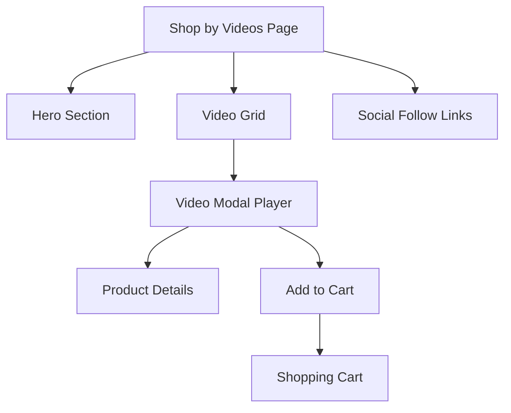

## 1. Product Overview
A dedicated video shopping experience page that showcases products through engaging video content, allowing customers to discover and purchase items featured in videos. This page creates an immersive shopping journey by combining visual storytelling with direct product purchasing capabilities.

The target audience includes visual-oriented shoppers who prefer discovering products through video content rather than traditional browsing, increasing engagement and conversion rates for the e-commerce platform.

## 2. Core Features

### 2.1 User Roles
| Role | Registration Method | Core Permissions |
|------|---------------------|------------------|
| Guest User | No registration required | View videos, browse products, add to cart |
| Registered User | Email registration | All guest permissions + save favorites, complete purchases |

### 2.2 Feature Module
Our Shop by Videos page consists of the following main components:
1. **Hero section**: Eye-catching banner with video shopping introduction and call-to-action.
2. **Video grid**: Responsive grid layout displaying video thumbnails with product overlays.
3. **Video modal player**: Full-screen overlay for video playback with integrated product information.
4. **Social follow links**: Social media integration for brand engagement and community building.

### 2.3 Page Details
| Page Name | Module Name | Feature description |
|-----------|-------------|---------------------|
| Shop by Videos | Hero section | Display compelling banner with video shopping headline, subheading explaining benefits, and prominent CTA button to start browsing videos. |
| Shop by Videos | Video grid | Show responsive grid of video thumbnails with product preview images, video duration, view counts, and quick-view hover effects. |
| Shop by Videos | Video modal player | Open full-screen modal with video player, product carousel below video, add-to-cart functionality, and related video suggestions. |
| Shop by Videos | Social follow links | Include Instagram, Facebook, YouTube, and TikTok follow buttons with follower counts and latest post previews. |

## 3. Core Process
**Customer Flow:**
User lands on Shop by Videos page → Views hero section with compelling CTA → Browses video grid with thumbnails → Clicks video to open modal player → Watches video while viewing featured products → Adds desired products to cart → Continues shopping or proceeds to checkout → Follows brand on social media for updates.

## 4. User Interface Design

### 4.1 Design Style
- **Primary colors**: Deep charcoal (#2C2C2C) for text, warm white (#FAFAFA) for backgrounds
- **Secondary colors**: Soft gold (#D4AF37) for accents and CTAs, muted gray (#6B6B6B) for secondary text
- **Button style**: Rounded corners (8px radius), subtle shadows, hover animations
- **Font**: Modern sans-serif (Inter or similar), 16px base size, responsive scaling
- **Layout style**: Card-based grid layout with generous white space
- **Icon style**: Minimalist line icons with consistent stroke width

### 4.2 Page Design Overview
| Page Name | Module Name | UI Elements |
|-----------|-------------|-------------|
| Shop by Videos | Hero section | Full-width banner with 1920x600px background image, centered headline text in 48px font, 20px subheading, prominent CTA button with 16px padding and gold background. |
| Shop by Videos | Video grid | Responsive 3-column grid on desktop (2 on tablet, 1 on mobile), 16px gap between cards, 300x400px video thumbnails with play button overlay, product count badge in top-right corner. |
| Shop by Videos | Video modal player | Full-screen overlay with 80% width video player, product carousel below with 150px thumbnail images, close button in top-right, auto-play on open with sound muted by default. |
| Shop by Videos | Social follow links | Horizontal row of social media icons with 32px size, follower count badges, hover effects with brand colors, links open in new tabs. |

### 4.3 Responsiveness
Desktop-first design approach with mobile optimization. Grid layout adapts from 3 columns on desktop to 2 on tablet and 1 on mobile. Video modal player adjusts to 95% width on mobile devices. Touch-friendly interactions with appropriate tap targets (minimum 44px).