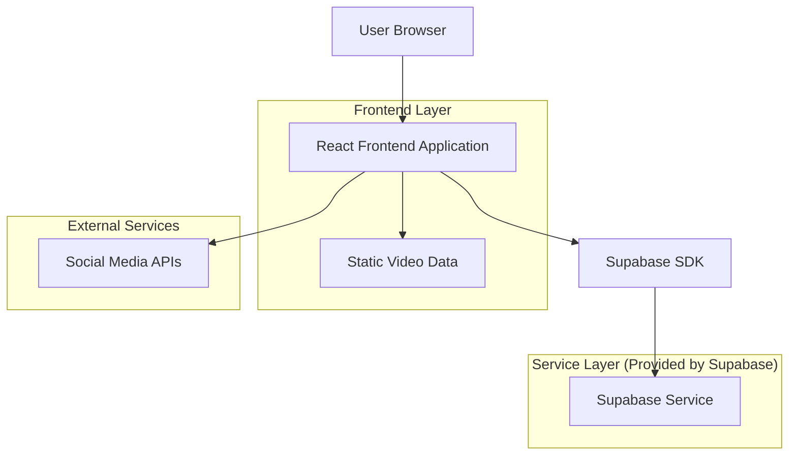
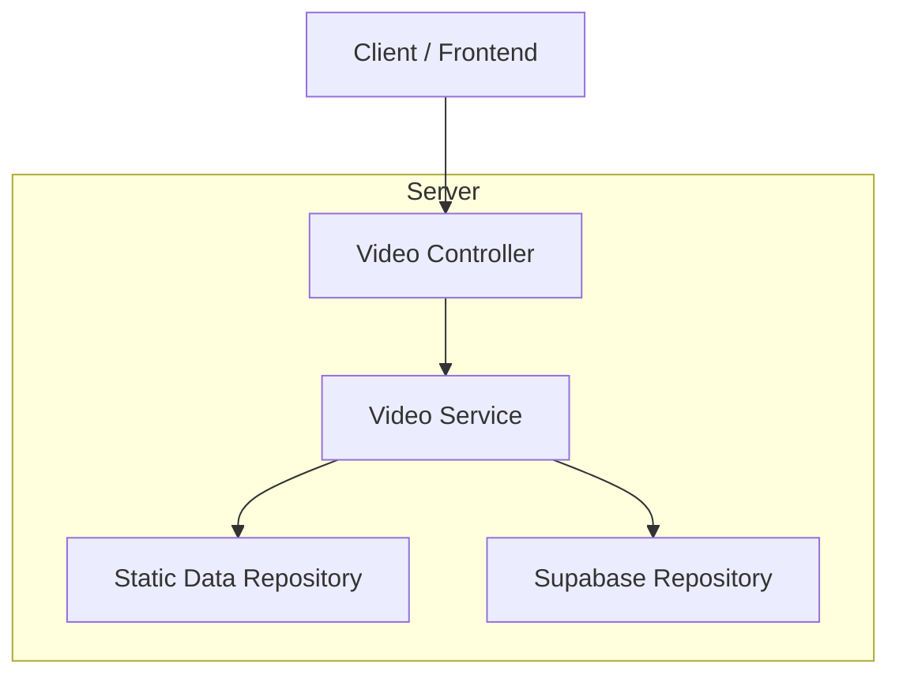
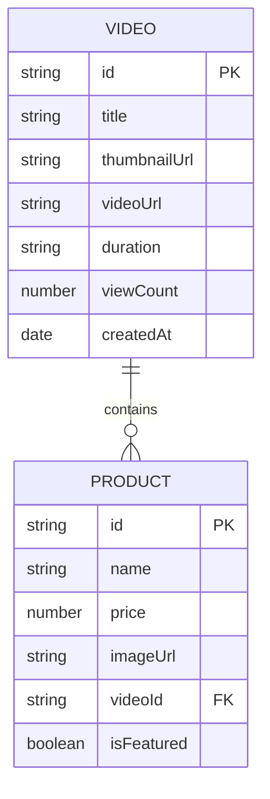

## 1. Architecture design



## 2. Technology Description

- Frontend: React@18 + tailwindcss@3 + vite
- Initialization Tool: vite-init
- Backend: Supabase (for user authentication and product data)
- Video Data: Static array (ready for dynamic integration)

## 3. Route definitions

| Route | Purpose |
|-------|---------|
| /shop-by-videos | Main Shop by Videos page displaying hero section, video grid, and social links |
| /api/videos | API endpoint for fetching video data (currently static, ready for dynamic) |

## 4. API definitions

### 4.1 Core API

Video data fetching
```
GET /api/videos
```

Response:
| Param Name | Param Type | Description |
|------------|-------------|-------------|
| videos | array | Array of video objects with metadata |
| totalCount | number | Total number of available videos |

Example response:
```json
{
  "videos": [
    {
      "id": "vid_001",
      "title": "Summer Collection 2024",
      "thumbnailUrl": "/images/videos/summer-thumb.jpg",
      "videoUrl": "/videos/summer-collection.mp4",
      "duration": "2:45",
      "viewCount": 15420,
      "products": [
        {
          "id": "prod_001",
          "name": "Floral Summer Dress",
          "price": 89.99,
          "imageUrl": "/images/products/dress-1.jpg"
        }
      ]
    }
  ],
  "totalCount": 24
}
```

## 5. Server architecture diagram



## 6. Data model

### 6.1 Data model definition



### 6.2 Data Definition Language

Video metadata table (videos)
```sql
-- create table
CREATE TABLE videos (
    id UUID PRIMARY KEY DEFAULT gen_random_uuid(),
    title VARCHAR(255) NOT NULL,
    thumbnail_url VARCHAR(500) NOT NULL,
    video_url VARCHAR(500) NOT NULL,
    duration VARCHAR(10) NOT NULL,
    view_count INTEGER DEFAULT 0,
    created_at TIMESTAMP WITH TIME ZONE DEFAULT NOW(),
    updated_at TIMESTAMP WITH TIME ZONE DEFAULT NOW()
);

-- create indexes
CREATE INDEX idx_videos_created_at ON videos(created_at DESC);
CREATE INDEX idx_videos_view_count ON videos(view_count DESC);

-- grant permissions
GRANT SELECT ON videos TO anon;
GRANT ALL PRIVILEGES ON videos TO authenticated;
```

Products in videos table (video_products)
```sql
-- create table
CREATE TABLE video_products (
    id UUID PRIMARY KEY DEFAULT gen_random_uuid(),
    video_id UUID REFERENCES videos(id),
    product_name VARCHAR(255) NOT NULL,
    product_price DECIMAL(10,2) NOT NULL,
    product_image_url VARCHAR(500) NOT NULL,
    is_featured BOOLEAN DEFAULT false,
    created_at TIMESTAMP WITH TIME ZONE DEFAULT NOW()
);

-- create indexes
CREATE INDEX idx_video_products_video_id ON video_products(video_id);
CREATE INDEX idx_video_products_featured ON video_products(is_featured);

-- grant permissions
GRANT SELECT ON video_products TO anon;
GRANT ALL PRIVILEGES ON video_products TO authenticated;
```

Static video data (initial implementation)
```javascript
// Static video data array for initial implementation
const staticVideos = [
  {
    id: 'vid_001',
    title: 'Summer Collection 2024',
    thumbnailUrl: '/images/videos/summer-thumb.jpg',
    videoUrl: '/videos/summer-collection.mp4',
    duration: '2:45',
    viewCount: 15420,
    products: [
      { id: 'prod_001', name: 'Floral Summer Dress', price: 89.99, imageUrl: '/images/products/dress-1.jpg' },
      { id: 'prod_002', name: 'Beach Sandals', price: 45.00, imageUrl: '/images/products/sandals-1.jpg' }
    ]
  },
  // Additional video objects...
];
```