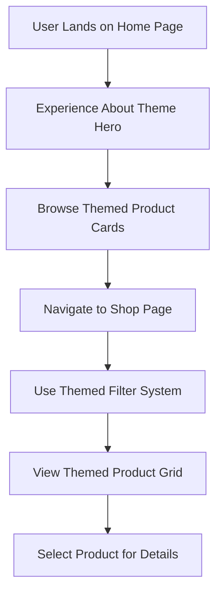

# Product Requirements: Theme Refactor - Apply About Page Theme to Home and Shop Pages

## 1. Product Overview

This project involves applying the elegant, warm design theme from the About page to the Home and Shop pages of the Decorizz e-commerce website. The goal is to create visual consistency across the platform while maintaining the sophisticated aesthetic that defines the About page's character.

The About page features a premium design with serif typography, warm beige backgrounds, and teal accents that create an inviting, artistic atmosphere. This theme will be extended to enhance the user experience on the primary shopping and browsing pages.

## 2. Core Features

### 2.1 User Roles
| Role | Registration Method | Core Permissions |
|------|---------------------|------------------|
| Visitor | No registration required | Browse products, view themed pages |
| Customer | Email registration | Full shopping functionality with new theme |
| Admin | Admin panel access | Manage products and theme settings |

### 2.2 Feature Module
The theme refactor consists of the following main pages with updated visual design:

1. **Home page**: Hero section, product showcases, testimonials, and promotional sections with About page theme
2. **Shop page**: Product grid, filters, and product cards with consistent About page styling

### 2.3 Page Details

| Page Name | Module Name | Feature description |
|-----------|-------------|---------------------|
| Home page | Hero section | Apply serif headings, warm beige background overlay, teal accent buttons with curved styling |
| Home page | Best Sellers carousel | Update card backgrounds to white with beige borders, serif product names, teal price accents |
| Home page | Custom Canvas promo | Apply warm gradient overlays with serif typography and curved image cards |
| Home page | Trust Center | Convert to soft-card styling with beige background, serif section titles, teal accent icons |
| Home page | Wall Art Collection | Update to warm color scheme with serif headings and curved image presentations |
| Home page | Testimonials | Apply beige card backgrounds, serif reviewer names, teal star ratings |
| Shop page | Header section | Update page title to serif font with teal underline accent |
| Shop page | Filter sidebar | Convert filter cards to soft beige styling with serif category names |
| Shop page | Product grid | Apply white card backgrounds with beige borders, serif product names, teal accents |
| Shop page | Pagination/Sorting | Update controls to match About page button styling with teal highlights |

## 3. Core Process

### User Flow
1. **Visitor arrives on Home page**
   - Sees warm beige background with serif hero text
   - Experiences consistent About page aesthetic throughout
   - Browses products with elegant card styling

2. **User navigates to Shop page**
   - Maintains visual consistency with Home page theme
   - Interacts with filters styled in About page aesthetic
   - Views products in elegant, curved card layouts

3. **User explores product details**
   - Seamless transition from themed shop to product pages
   - Consistent typography and color scheme maintained

## 4. User Interface Design

### 4.1 Design Style
- **Primary Colors**: Warm beige (#f3f1ed) backgrounds, white (#ffffff) card surfaces
- **Accent Colors**: Teal (#14b8a6) for interactive elements and highlights
- **Typography**: Noto Rashi Hebrew serif font for all headings and important text
- **Button Style**: Rounded rectangles with subtle shadows and teal backgrounds
- **Card Styling**: Soft rounded corners (20px radius), gentle shadows, beige border accents
- **Layout Style**: Card-based design with generous spacing and elegant proportions

### 4.2 Page Design Overview

| Page Name | Module Name | UI Elements |
|-----------|-------------|-------------|
| Home page | Hero section | Full-width image with warm beige gradient overlay, large serif headline text, curved teal accent buttons |
| Home page | Product cards | White background cards with 20px rounded corners, beige border accents, serif product names, teal price highlights |
| Shop page | Filter panel | Soft beige background panels with serif category headers, rounded filter buttons with teal selection states |
| Shop page | Product grid | Responsive grid of white cards with consistent About page styling, hover effects with gentle lift animations |

### 4.3 Responsiveness
- **Desktop-first approach**: Optimized for large screens with elegant spacing
- **Mobile adaptation**: Maintains theme consistency with touch-friendly interactions
- **Touch optimization**: Larger tap targets for mobile users while preserving aesthetic
- **Breakpoint strategy**: Seamless scaling from desktop to tablet to mobile layouts