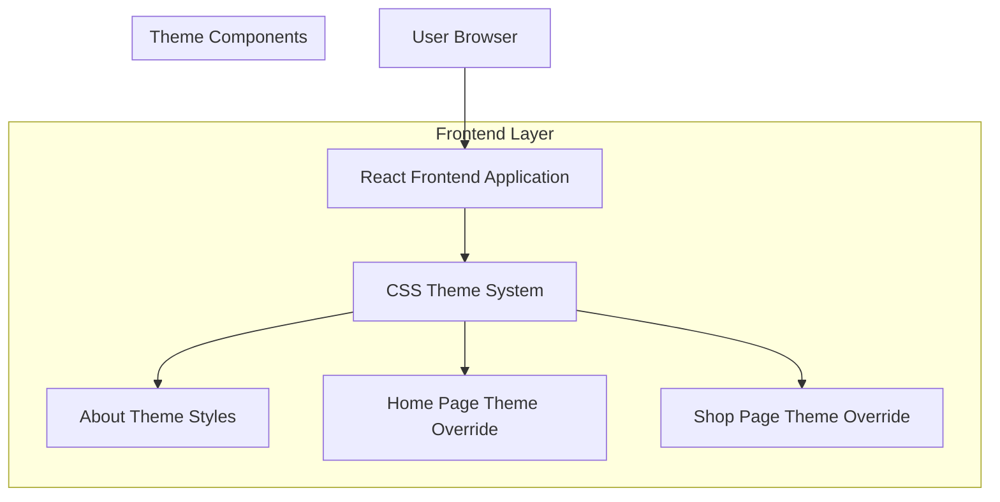

# Theme Refactor: Applying About Page Theme to Home and Shop Pages

## 1. Architecture Design



## 2. Technology Description

- **Frontend**: React@18 + TailwindCSS@4 + Vite
- **Styling**: CSS Modules + TailwindCSS + Custom CSS
- **Theme System**: Scoped CSS classes with inheritance
- **Initialization Tool**: vite-init
- **Backend**: None (Frontend only changes)

## 3. Current Theme Analysis

### About Page Theme (Source)
- **Typography**: Noto Rashi Hebrew serif font for headings
- **Color Palette**: 
  - Background: #f3f1ed (warm beige)
  - Primary Accent: #14b8a6 (teal)
  - Text: #3b2f27 (warm brown)
  - Card Background: #ffffff
- **Card Styling**: Rounded corners (20px), soft shadows, border accents
- **Animation**: Smooth fade-ins, hover lifts, curved image cards

### Target Pages (Home & Shop)
- **Current**: Modern minimal design with sans-serif fonts
- **Goal**: Apply About page's warm, elegant aesthetic

## 4. Implementation Strategy

### 4.1 CSS Class Structure
```css
/* Scoped theme classes */
.about-theme { /* existing about page styles */ }
.home-theme { /* new home page theme override */ }
.shop-theme { /* new shop page theme override */ }
```

### 4.2 Component Changes
- **HomePage.tsx**: Add `home-theme` class to root div
- **ShopPage.tsx**: Add `shop-theme` class to root div
- **CSS Files**: Create theme override classes in index.css

### 4.3 Theme Inheritance
- Preserve existing functionality and layout
- Override only visual styling (colors, fonts, shadows, borders)
- Maintain responsive design and animations

## 5. CSS Implementation Details

### 5.1 Typography Overrides
```css
.home-theme h1,
.home-theme h2,
.home-theme h3,
.shop-theme h1,
.shop-theme h2,
.shop-theme h3 {
  font-family: "Noto Rashi Hebrew", serif !important;
  font-weight: 700 !important;
  color: #3b2f27 !important;
}
```

### 5.2 Background and Card Styling
```css
.home-theme,
.shop-theme {
  background-color: #f3f1ed !important;
}

.home-theme .card-soft,
.shop-theme .card-soft,
.home-theme .product-card,
.shop-theme .product-card {
  border-radius: 20px !important;
  background: #ffffff !important;
  border: 1px solid #e4ddd3 !important;
  box-shadow: 0 12px 25px rgba(0,0,0,0.08) !important;
}
```

### 5.3 Accent Colors
```css
.home-theme .accent,
.shop-theme .accent {
  color: #14b8a6 !important;
}

.home-theme .btn-primary,
.shop-theme .btn-primary {
  background-color: #14b8a6 !important;
}
```

## 6. Animation Preservation

Maintain existing animations while applying new theme:
- Hero fade animations
- Card hover effects
- Slider animations
- Loading states

## 7. Responsive Design

Ensure theme overrides maintain responsive behavior:
- Mobile-first approach
- Breakpoint consistency
- Touch interaction optimization

## 8. Performance Considerations

- Use CSS custom properties for theme variables
- Minimize specificity conflicts
- Leverage Tailwind's utility classes where possible
- Avoid !important unless necessary for overrides

## 9. Browser Compatibility

- Modern browser support (ES6+, CSS Grid/Flexbox)
- Fallback fonts for Noto Rashi Hebrew
- Progressive enhancement approach

## 10. Testing Strategy

- Visual regression testing for theme consistency
- Cross-browser compatibility testing
- Mobile responsiveness verification
- Accessibility contrast ratio validation